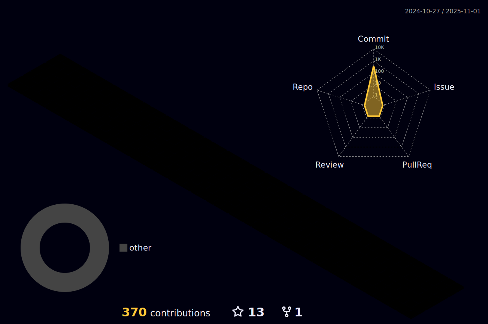

  

  

	

<h3 align="center" style='margin: 32px 4px 8px; font-size: 24px;'>
  Connect with me:
</h3>

<h3 align="center" style='margin: 32px 4px 8px; font-size: 24px;'>
  Languages and Tools:
</h3>

             
    

|||
|-|-|

|-|

    

  
  
 

 
 •

